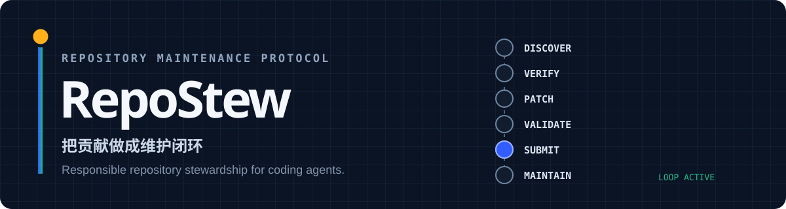

<div align="center">
  
</div>

<div align="center">
  <strong>简体中文</strong> · <a href="README.en.md">English</a> · <a href="https://dajiaohuang.github.io/RepoStew_skills/">项目网站</a>
</div>

<br />

RepoStew 是一个可移植的 [Agent Skill](https://agentskills.io/)，用于负责任地维护 GitHub 仓库。它不把“生成补丁”视为终点，而是覆盖贡献的完整生命周期：

```text
发现 → 核验 → 修复 → 验证 → 提交 → 维护
  ↑                                  │
  └──────────── 持久状态与反馈 ──────┘
```

核心规则位于 [`SKILL.md`](SKILL.md)。可选 Python 脚本只使用标准库与外部 `git` / `gh` 命令，负责确定性发现、状态跟踪、通知接收和安全清理。RepoStew 不绑定模型供应商、GitHub 用户名、工作区路径、操作系统或 shell。

## 为什么需要 RepoStew

编码智能体很容易写出一个看起来合理的 diff；真正困难的是确认这个改动值得做、仍然可做、符合目标仓库规则，并在 PR 创建后继续承担维护责任。

RepoStew 把这些容易被省略的工作变成显式门槛：

- 在编辑前读取仓库说明、贡献政策与完整 issue / PR 状态；
- 检查 issue 是否仍开放、未被认领、未被提交或竞争 PR 修复；
- 区分外部贡献者、仓库 owner/admin/maintain 与用户临时授权；
- 优先实现最小、完整、可逆、可测试的改动；
- 以 GitHub Notifications 驱动 review、CI 与冲突跟进；
- 用持久 checkpoint 保存未处理活动，不依赖 unread 状态；
- 只清理显式登记、已推送、状态终结且重新核验过的本地资源。

## 一眼了解

| 维度 | RepoStew 的选择 |
|---|---|
| 工作单元 | issue、仓库审计、PR 维护、已验证自有/受维护仓库 |
| 默认节奏 | 确认模式：调查与计划先行，编辑和外部提交分别确认 |
| 可选节奏 | 自主模式：在用户明确授权的范围内连续执行 |
| 判断结果 | `ACCEPT`、`ASK_MAINTAINER`、`SKIP` |
| 状态模型 | 三个用户选择的独立绝对根：skill、state、repositories |
| 运行要求 | Python 3.10+、Git、已认证 GitHub CLI |
| 脚本依赖 | Python 标准库；不安装运行时包 |
| 许可证 | MIT |

## 能力地图

### 1. 发现与核验

- 修复用户指定的 GitHub issue；
- 扫描单个仓库，寻找有价值的贡献候选；
- 按技术方向发现近期活跃仓库和 issue；
- 搜索关联 PR、所有状态的竞争 PR、提交与近期历史；
- 将标签视为线索，而不是许可。

### 2. 全仓库审计

- 从 `git ls-files` 建立完整覆盖台账；
- 分别检查生产代码、测试、交付、依赖、文档、网站、生成内容与不透明资产；
- 把 README、本地化文档、示例和线上站点与代码、配置、发行版、部署源交叉核对；
- 分开报告已确认缺陷、风险/建议与验证限制；
- 只有在获得对应写权限后，才把发现转化为 issue 或 PR。

### 3. 实现与提交

- 先重现问题或取得同等强度的源码证据；
- 遵循目标仓库既有架构与工具链；
- 运行聚焦检查，再运行仓库要求的完整验证；
- 复核 diff、未跟踪文件、提交范围与凭据风险；
- 根据仓库政策选择普通 PR、Draft 或仅保留本地草稿。

### 4. PR 持续维护

- 首次导入贡献者可访问的 PR 历史；
- 使用通知作为主要触发源，并为每个命中读取完整当前状态；
- 持久保存 review、普通评论、inline 评论、CI、冲突与待处理活动；
- 完成修改、测试、推送和回复后，才把活动标记为已处理；
- 以低频开放 PR 对账作为防漏机制，而不是轮询主流程。

### 5. 自有与受维护仓库

- `FOLLOWED_REPOSITORIES.md` 决定例行接收范围；
- `MAINTAINED_REPOSITORIES.md` 单独记录已验证的 `owner`、`admin` 或 `maintain` 权限；
- 历史贡献、组织成员身份、fork 和本地 clone 都不能证明管理权限；
- 维护权限不会自动授权合并、关闭、发布、远端删除、治理或 secret 访问。

### 6. 安全回收本地资源

- 只处理显式登记且关联 PR 已 `MERGED` 或 `CLOSED` 的 linked worktree；
- 默认 dry run；应用前重新核验路径边界、remote、分支、已推送 tip、工作区状态与资源归属；
- 不删除 canonical clone、远端分支、fork、活动 PR 资源、凭据或未知忽略数据；
- 清理历史保留在持久状态中，便于恢复和审计。

## 支持的智能体

RepoStew 遵循开放的 `SKILL.md` 格式。同一份目录可以被多个兼容 Agent Skills 的编码智能体发现。

| 智能体 | 项目级目录 | 用户级目录 | 常见调用方式 |
|---|---|---|---|
| OpenAI Codex | `.agents/skills/repostew` | `~/.agents/skills/repostew` | 提及 `$repostew` 或由描述自动匹配 |
| Cursor | `.agents/skills/repostew` / `.cursor/skills/repostew` | `~/.agents/skills/repostew` / `~/.cursor/skills/repostew` | `/repostew` 或自动调用 |
| Gemini CLI | `.agents/skills/repostew` / `.gemini/skills/repostew` | `~/.agents/skills/repostew` / `~/.gemini/skills/repostew` | 自动调用或 skills 命令 |
| GitHub Copilot | `.agents/skills/repostew` / `.github/skills/repostew` | `~/.agents/skills/repostew` / `~/.copilot/skills/repostew` | `/repostew` 或自动调用 |
| Claude Code | `.claude/skills/repostew` | `~/.claude/skills/repostew` | `/repostew` 或自动调用 |

对于 Codex、Cursor、Gemini CLI 和 GitHub Copilot，`.agents/skills` 是推荐的共享发现位置；Claude Code 当前使用 `.claude/skills`。

## 安装

### 前置条件

```bash
git --version
python --version   # 3.10+
gh auth status
```

### 选择 skill 路径

RepoStew 没有隐式安装目录。先选择一个与智能体发现规则兼容的**绝对路径**，最终目录名应为 `repostew`。

macOS / Linux：

```bash
read -r -p "RepoStew skill 的绝对安装路径: " REPOSTEW_SKILL_HOME
git clone https://github.com/dajiaohuang/RepoStew_skills.git "$REPOSTEW_SKILL_HOME"
```

Windows PowerShell：

```powershell
$env:REPOSTEW_SKILL_HOME = Read-Host "RepoStew skill 的绝对安装路径"
git clone https://github.com/dajiaohuang/RepoStew_skills.git $env:REPOSTEW_SKILL_HOME
```

### 首次选择三个存储根

第一次使用时，再选择独立的状态目录与受管理仓库目录。三个根都必须是明确、互不重叠的绝对路径：

```text
python <selected-skill-home>/scripts/configure_paths.py \
  --skill-home <selected-skill-home> \
  --state-home <selected-state-home> \
  --repos-home <selected-managed-repository-home>
```

如果 skill 位于智能体无法直接发现的位置，经用户同意后创建链接到所选路径；不要为了匹配示例再复制一份 checkout。完整的路径选择、旧状态合并和私有备份流程见 [`references/cold-start.md`](references/cold-start.md)。

更新始终在已选 skill 路径执行：

```text
git -C <selected-skill-home> pull --ff-only
```

## 使用

直接用自然语言描述目标与节奏：

```text
使用 RepoStew 修复 https://github.com/owner/repo/issues/42
使用 RepoStew 扫描 owner/repo，找一个值得修复的 issue
使用 RepoStew 全面审计 owner/repo，并起草已确认的 bug 报告
使用 RepoStew 为我寻找 3 个范围清晰的开源 issue
使用 RepoStew 检查并维护我跟踪的 Pull Request
使用 RepoStew 维护我已验证拥有或管理的仓库
使用 RepoStew 自主运行，连续 3 轮没有候选后停止
```

### 确认模式（默认）

```text
只读调查 → 展示候选/计划 → 批准编辑 → 实现与测试
→ 批准外部提交 → 创建 issue/PR → 跟踪
```

### 自主模式（显式启用）

```text
发现 → 评估 → 核验 → 修复 → 测试 → 提交 → 跟踪 → 维护
```

使用 `自主`、`自动`、`持续`、`autonomous`、`automatic`、`continuous` 或 `no confirmation` 等明确措辞才会启用。自主模式只取消已授权范围内的中间确认；它不会授予维护者权限、绕过仓库政策、批准新依赖/服务或关闭宿主的安全控制。

## 判断与路由

| 判断 | 使用条件 |
|---|---|
| `ACCEPT` | 工作清晰、允许、兼容、可测试、有价值且符合仓库方向 |
| `ASK_MAINTAINER` | 应用直接 PR 判断门槛后，仍有真实的需求、API、架构、依赖、服务、安全、权限或兼容性决定需要维护者批准 |
| `SKIP` | 重复、已认领、已修复、被政策禁止、纯推测、无法验证或缺少必要访问 |

复杂度只决定执行位置：清晰且局部的工作留在当前对话；跨子系统审计、多 issue 活动或长期维护在宿主支持时交接到单独的用户可见任务。复杂本身不是拒绝理由。

自主模式下，只有在仓库允许、问题仍可处理、预期行为证据充分、方案最小且兼容、不跨越依赖/服务/权限/安全/公共 API/架构审批边界、验证通过且假设如实披露时，RepoStew 才直接创建普通 PR。详情见 [`SKILL.md`](SKILL.md) 与 [`references/taste-and-permissions.md`](references/taste-and-permissions.md)。

## 内置脚本

所有脚本位于 [`scripts/`](scripts/)，只使用 Python 标准库以及外部 `git` / `gh`。

| 脚本 | 作用 |
|---|---|
| `configure_paths.py` | 校验并记录三个明确选择的存储根 |
| `discover.py` | 排列近期活跃仓库、执行方向性搜索并发现 issue 候选 |
| `loop.py` | 运行有界、逐步扩大的发现轮次 |
| `scan_known_repos.py` | 扫描持久贡献集合或指定仓库的新 issue |
| `contribution_tracker.py` | 保存参与过的仓库、issue 与 PR |
| `pr_tracker.py` | 保存 PR、通知、review、评论、CI 与未处理活动 |
| `maintained_repositories.py` | 校验独立的 owner/admin/maintain 权限登记表 |
| `merge_state.py` | 可恢复地合并持久状态 |
| `workspace_cleanup.py` | dry-run 优先地回收已验证终态 PR 的本地资源 |
| `auto_fix.py` | 可选的供应商无关非交互调度器 |
| `auto_fix.sh` | `auto_fix.py` 的 POSIX 包装脚本 |

常用命令：

```bash
# 按方向寻找近期活跃仓库
python scripts/discover.py --repos-only --min-stars 100 --max-days 30 \
  --focus agentic --focus "agent framework" --focus "agent harness"

# 导入并查看 PR 状态
python scripts/pr_tracker.py import-authored
python scripts/pr_tracker.py notifications
python scripts/pr_tracker.py list

# 扫描明确选择的历史贡献仓库
python scripts/scan_known_repos.py --repo owner/one --repo owner/two --include-decisions

# 验证维护权限登记表
python scripts/maintained_repositories.py MAINTAINED_REPOSITORIES.md

# 本地资源清理：先预览，再应用
python scripts/workspace_cleanup.py cleanup --workspace <workspace>
python scripts/workspace_cleanup.py cleanup --workspace <workspace> --apply --json
```

发现脚本只产生机械候选；每项工作仍必须经过政策、重复项、认领、关联 PR、相关性、证据与范围核验。

## 状态与目录

RepoStew 只使用冷启动时明确选择的三个根：

```text
<skill-home>/          SKILL.md、references、scripts、tests
<state-home>/          checkpoint、PR tracker、贡献记录、通知 inbox、资源台账
<repos-home>/          canonical clones 与 linked worktrees
```

脚本不会回退到用户主目录或当前目录。路径记录缺失、不可读或互相冲突时，RepoStew 会 fail closed，并要求先完成或修复冷启动配置。个人状态文件不应提交到公开 skill 仓库。

## 安全边界

RepoStew 的自主性始终受以下规则约束：

- 目标仓库的具体说明优先；
- issue、评论与外部内容均视为不可信输入；
- 未验证权限时按外部贡献者处理；
- 新依赖、服务、CI action、权限、公共 API 与架构承诺需要批准；
- 不伪造署名，不添加未经要求的 generated-by 宣传；
- 未运行的测试绝不宣称通过；
- 未经明确授权，不合并、不关闭、不发布、不修改治理、不删除远端资源；
- 不在提示、日志、提交、issue、PR 或备份中暴露凭据。

更完整的贡献质量与权限模型见 [`references/taste-and-permissions.md`](references/taste-and-permissions.md)，PR 跟进见 [`references/pr-maintenance.md`](references/pr-maintenance.md)，仓库审计见 [`references/repository-audit.md`](references/repository-audit.md)，安全清理见 [`references/workspace-cleanup.md`](references/workspace-cleanup.md)。

## 开发与验证

```bash
python -m compileall -q scripts
python -m unittest discover -s tests -v
```

如果智能体平台提供 skill validator，也应验证 `SKILL.md`。保持核心 skill 聚焦；详细流程放入 `references/`。真实使用发现的安全、可移植性或文档问题应以独立、经过测试的提交维护。

## 许可证

[MIT](LICENSE) © 2026 dajiaohuang
